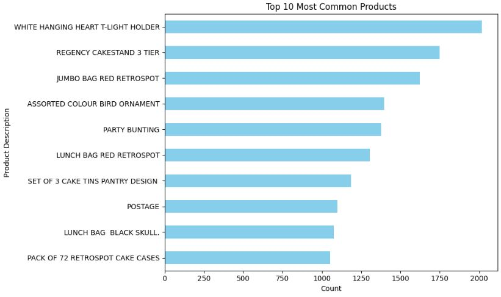
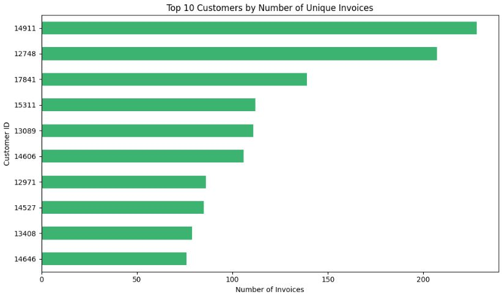
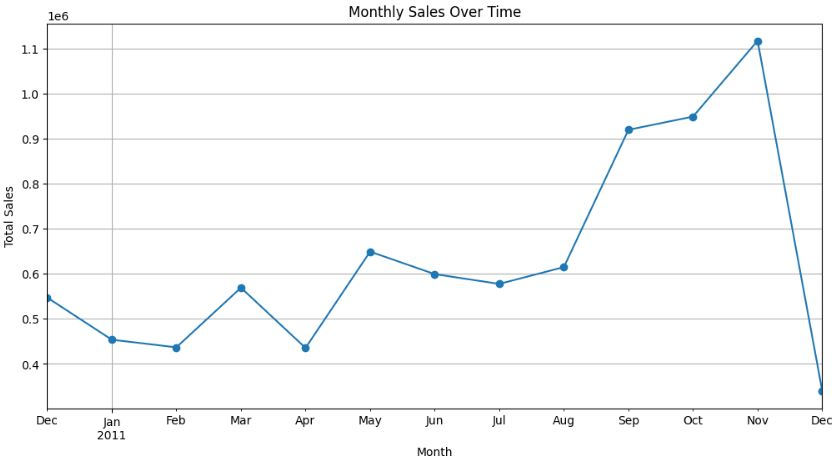
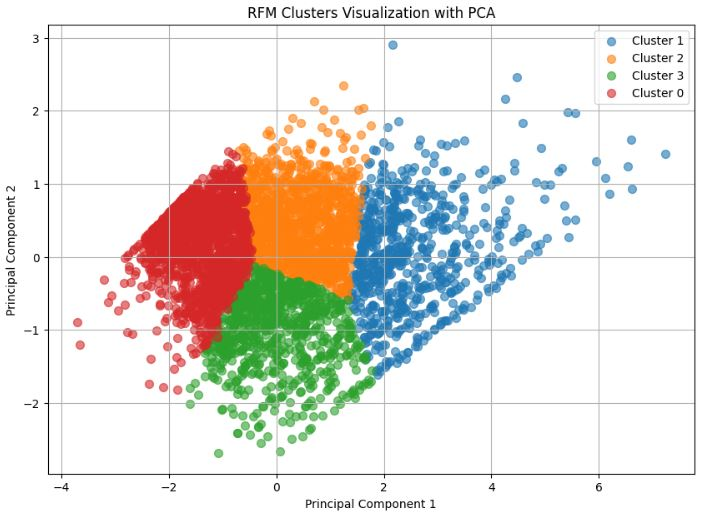
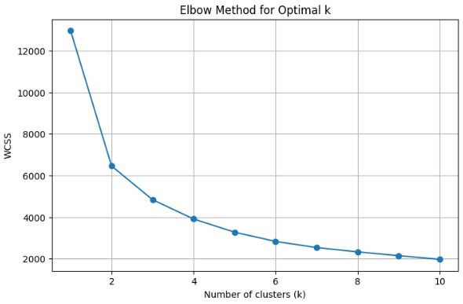
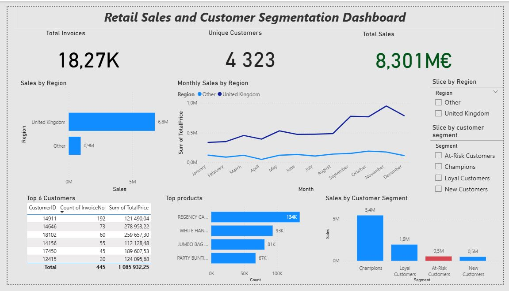

# 🛍️ Retail Sales Analysis & Customer Segmentation

This project analyzes retail sales data using Python for data preprocessing and customer segmentation, and visualizes key insights in a Power BI dashboard. It combines data science with business intelligence to support stakeholder decision-making.

---

## 📁 Project Overview

This project consists of two main parts:

1. **🧠 Jupyter Notebook: Data Preprocessing & Customer Segmentation**
2. **📊 Power BI Dashboard: Sales Reporting & Insights**

---

## 📦 Dataset

The dataset is based on an online retail transaction dataset, containing sales records such as:

- InvoiceNo
- StockCode
- Description
- Quantity
- InvoiceDate
- UnitPrice
- CustomerID
- Country

---

## 🧠 Part 1: Data Preprocessing (Python / Jupyter Notebook)

### ✅ Cleaning Steps:

- Removed duplicates and null entries.
- Standardized country names (e.g., `EIRE` → `Ireland`).
- Removed rows with negative `UnitPrice` and extreme outliers.
- Converted refunds using a new column `IsRefund`.
- Feature engineering: `TotalPrice = Quantity × UnitPrice`.

### 📉 Outlier Detection:

- Used **IQR method** for detecting outliers in `UnitPrice` (due to skewed distribution).
- Used **Robust Z-score** for `Quantity` (due to more normal distribution).
- Removed extreme invalid entries but preserved valid high-value orders.

### 🗺️ Some Vizualisation:

#### 📌 Most Sold Products

#### 👑 Top Customers

#### 📈 Sales Over Time

### 🧩 RFM Feature Engineering:

We created an **RFM table** per customer:

- `Recency`: Days since the customer's last purchase
- `Frequency`: Total number of purchases
- `Monetary`: Total money spent
- `TotalPrice`: Total price of a set of products bought

Refund transactions were excluded from this calculation.

### 📏 Scaling & Clustering:

- Applied `log1p` transformation to reduce skew in RFM values.  
- Scaled using `StandardScaler`.  
- Chose **K=4** using the Elbow Method with KMeans clustering.

#### 🔍 RFM Cluster Segmentation  

#### 📐 Elbow Method  

### 🧠 Customer Segmentation:

| Cluster | Recency | Frequency | Monetary | Interpretation         |
|---------|---------|-----------|----------|-------------------------|
| 0       | 18.5    | 2.1       | 537.2    | 🟠 At-Risk Customers     |
| 1       | 12.1    | 13.6      | 7919.3   | 🟢 Champions             |
| 2       | 71.4    | 4.0       | 1729.1   | 🔵 Loyal Customers       |
| 3       | 184.7   | 1.3       | 336.7    | 🔴 New Customers         |

Segment labels were assigned and merged back into the retail dataset (non-refund only).

---

## 📊 Part 2: Power BI Dashboard

---
### 🌐 Interactive Power BI Dashboard

You can explore the interactive Power BI dashboard for this project here:  
[Retail Sales & Customer Segmentation Dashboard](https://app.powerbi.com/view?r=eyJrIjoiZmRlMDNlMDctODhhZi00NmRkLWFlYmEtYzY4MDg2YTkxZTkyIiwidCI6IjcwMjVlMDRjLTcwY2EtNDhiZi1hYjdiLTczOTU0Y2I4NDZhZCIsImMiOjl9)

---

📋 BI Dashboard

The final dashboard includes the following visuals:

### 📌 Summary Cards:
- Total number of invoices
- Unique customers
- Total sales in currency

### 🌍 Sales by Region:
- Bar chart of total sales by country (aggregating non-UK as "Other")
- A slicer to switch between segments or countries

### 📈 Sales Trend Over Time:
- Monthly line chart showing `TotalPrice` by region
- Filterable by customer segment or region

### 👑 Top Customers and sales by customer segment:
- Table showing top 6 customers by total spending
- Bar chart showing amount spent by customer segment

### 🔄 Top Products:
- Bar chart showing most sold products

---

## Datasets Used

The datasets used in this project include:

- **Online Retail.xlsx**: The original retail transaction dataset sourced from [Kaggle - Online Retail Dataset](https://www.kaggle.com/datasets/hellbuoy/online-retail-dataset). It contains detailed customer transactions from a UK-based online retailer.
- **final_retail_dataset.csv**: The cleaned and preprocessed dataset derived from the original Excel file, used for analysis and modeling.
- **retail_all.csv**: The initial raw dataset before cleaning and feature engineering.

## Tools and Technologies Used

This project leveraged the following tools:

- **Python** — Used for data quality assessment, cleaning, feature engineering, and customer segmentation. Key libraries include `pandas`, `numpy`, `matplotlib`, `seaborn`, and `scikit-learn`.
- **Power BI** — Used as the Business Intelligence tool to create interactive dashboards and visualizations that present sales trends and customer segmentation insights.

---

